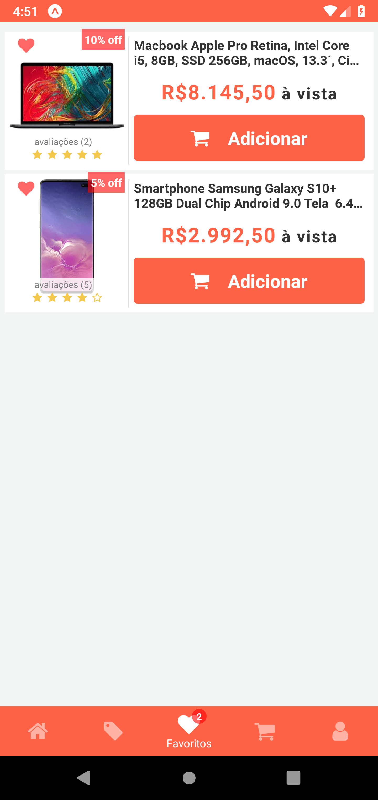

<h1 align="center">
 
  
 
 
Tech Store E-commerce
</h1>

Application created for the purpose of study, an ecommerce store

  

## Features

- ⚛️ **React Native** — A lib that provides a way to create native apps for Android and iOS
- 💹 **Json Server with Relationships** — fake REST API with zero coding
- ♻ **Redux with Redux Saga** — State management with middleware
- 💅 **Styled Components** — styled-components
- 🌸 **Reactotron** - Helps debugging process
- 💖 **Lint** — ESlint/Prettier/Editor Config

## TO-DO

- [ ] Implement Animations

## Getting started

1. Clone this repo using `git clone https://github.com/mfzaguiar/e-commerce-app.git`
2. Move yourself to the appropriate directory: `cd e-commerce-app` 
3. Run `yarn` to install dependencies 

### Getting started with the json server with relationship

1. Open new terminal
2. Run: `yarn server`

### Getting started with the mobile app

1. Run `expo start`

Note: If you choose to start the mobile app in the android.

Change the <strong>baseURL</strong> in file <strong>api.js</strong> located in <strong>services/api.js</strong>

- Genymotion emulator:
  `http://10.0.3.2:3000`
- Android emulator:
  `http://10.0.2.2:3000`
- Android device:
  `http://'YOUR-LOCAL-IP':3000`

  If you having trouble with android device, I recommend you to use the
  [**Ngrock**](https://ngrok.com/)

## Login in app

1. Use the follow credentials to login  
   email: admin@hotmail.com 
   password: 12345   or  
   email: teste@hotmail.com 
   password: 123

## License

This project is licensed under the MIT License - see the [LICENSE](https://opensource.org/licenses/MIT) page for details.

## Author

- [**Matheus Aguiar**](https://www.linkedin.com/in/mfzaguiar/)
